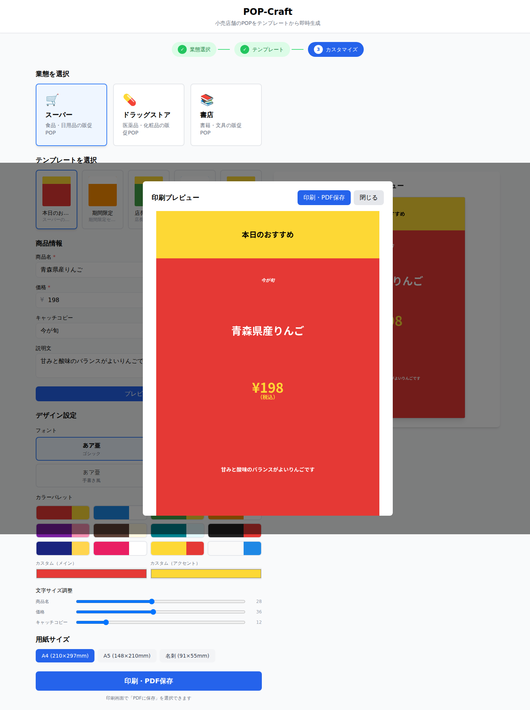

# POP-Craft

[](https://github.com/akaitigo/pop-craft/actions/workflows/ci.yml)

小売店舗のPOP（店頭販促物）をテンプレートから即時生成するPOPデザインツール。

## クイックスタート

```bash
cd frontend && pnpm install && pnpm dev
# → http://localhost:3000
```

本番サイトはブラウザ内で完結し、Go APIを起動する必要はありません。

## 機能

- **業態別テンプレート** — スーパー / ドラッグストア / 書店（15種類）
- **リアルタイムプレビュー** — Canvas APIで入力と同時に描画
- **フォント4種** — ゴシック / 明朝 / 手書き風 / 筆文字
- **カラーパレット** — プリセット12色 + カスタムカラー
- **印刷・PDF保存** — A4 / A5 / 名刺サイズをブラウザの印刷画面から出力
- **プライバシー** — 入力した商品情報を外部APIへ送信しない

## スクリーンショット



## 技術スタック

| レイヤー | 技術 |
|---------|------|
| Frontend | TypeScript / Next.js 15 (App Router) / TailwindCSS |
| POP描画 | Canvas API |
| テンプレート | 型付きTypeScript静的データ |
| 印刷・PDF保存 | Browser Print API |
| 本番配信 | Next.js Static Export |
| バリデーション | Zod |
| CI | GitHub Actions |

`backend/`のGo API・PDF実装は比較検証用に残していますが、本番サイトの実行時依存ではありません。

## アーキテクチャ

```
┌──────────────────────────────────────────┐
│ Next.js Static Export                    │
│ ├─ 固定テンプレート                      │
│ ├─ 商品情報・デザイン設定                │
│ ├─ Canvas Preview                        │
│ └─ Browser Print / PDF保存               │
└──────────────────────────────────────────┘
```

## 開発コマンド

```bash
make check    # lint + test + build
make dev      # 静的frontendを開発モードで起動
make dev-backend # 比較検証用Go APIを起動
make test     # 全テスト実行
make lint     # 全lint実行
make build    # 全ビルド
```

静的成果物は`frontend/out/`へ生成されます。

## プロジェクト構造

```
pop-craft/
├── frontend/            # Next.js 15 App
│   └── src/
│       ├── app/         # ページ・レイアウト
│       ├── components/  # UIコンポーネント
│       ├── data/        # 固定テンプレート
│       ├── hooks/       # カスタムHook
│       ├── lib/         # Canvas・バリデーション
│       └── types/       # 型定義
├── backend/             # 比較検証用Go API
│   ├── cmd/server/      # エントリーポイント
│   └── internal/
│       ├── handler/     # HTTPハンドラ
│       ├── model/       # ドメインモデル
│       ├── pdf/         # PDF生成
│       └── template/    # テンプレートデータ
├── db/migrations/       # SQLマイグレーション
├── docs/                # PRD・ADR
└── .github/workflows/   # CI
```

## テスト

- **Frontend**: 67テスト（Vitest + Testing Library）
- **Backend**: 全パッケージカバレッジ（Go test -race）

## ドキュメント

- [PRD](docs/PRD.md) — プロダクト要件定義
- [ADR-001](docs/adr/001-template-storage-strategy.md) — テンプレート保存戦略
- [ADR-002](docs/adr/002-canvas-api-for-preview.md) — Canvas API採用理由
- [ADR-003](docs/adr/ADR-003-static-first-deployment.md) — 固定費0円のブラウザ完結構成

## ライセンス

MIT
